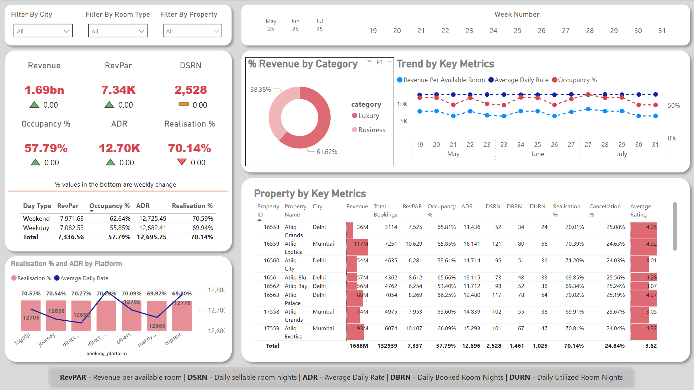

# 🏨 Hotel Booking Insights Dashboard

## 📌 Project Overview
This project is a **Power BI dashboard** that provides insights into hotel bookings, revenue, and key performance metrics such as **RevPAR, ADR, Occupancy Rate, and Realization %**. The dashboard helps hotel management analyze business performance, identify trends, and make data-driven decisions.

## 🛠️ Tools Used
- **Power BI** – For data visualization and interactive reporting.
- **SQL** – Used for data extraction, transformation, and aggregation.
- **Excel/CSV Files** – Data sources for bookings, hotels, rooms, and dates.

---

## 📊 Key Insights from the Dashboard
🔹 **Revenue Performance**
   - **Total Revenue:** ₹1.69bn  
   - **RevPAR (Revenue per Available Room):** ₹7.34K  
   - **Total Daily Sellable Room Nights (DSRN):** 2,528  

🔹 **Hotel Booking Trends**
   - **Highest Revenue Cities:** Mumbai & Delhi  
   - **% Revenue by Category:** **Luxury (38.38%) vs Business (61.62%)**  
   - **Booking Trends:** Weekly revenue and occupancy percentage fluctuations.  

🔹 **Customer & Market Behavior**
   - Weekday vs Weekend booking patterns.
   - **Booking platforms** impact on revenue and ADR.

---

## 📂 Dataset Information
| File Name                      | Description |
|--------------------------------|------------|
| `fact_bookings.csv`            | Raw booking transactions (booking date, revenue, occupancy, etc.). |
| `fact_aggregated_bookings.csv` | Aggregated booking data (summary statistics for reporting). |
| `dim_hotels.csv`               | List of hotels with their locations. |
| `dim_rooms.csv`                | Room classification details (Luxury, Business). |
| `dim_date.csv`                 | Date information for trend analysis. |
| `metrics_list.xlsx`            | List of key metrics used in the dashboard. |

---

## 📌 Features of the Dashboard
- **Dynamic Filters** → Select city, room type, and property.
- **Key Performance Metrics** → RevPAR, ADR, Occupancy %, Cancellation %.
- **Revenue Breakdown** → Revenue per city, booking trends, realization % by platform.
- **Trend Analysis** → Track revenue & key metrics across time.

---

## 🔌 How to Use the Dashboard
1. **Clone the repository**:
   ```sh
   git clone https://github.com/yourusername/hotel-booking-dashboard.git

---
## 📸 Dashboard Screenshot


## 📌 Future Improvements
- Implement real-time data updates with a SQL database connection.
- Add predictive analytics using Power BI DAX measures.
- Create drill-through reports for deeper insights into city-level performance.

